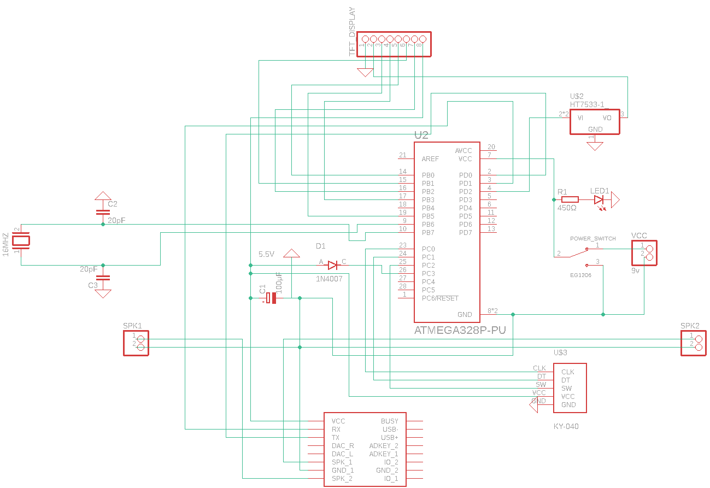
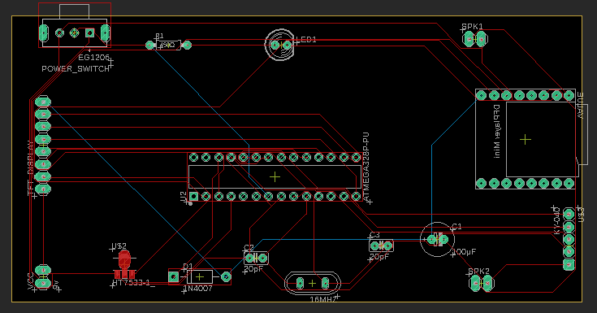

# Mini Mp3 Player
Mini Mp3 Player with Custom PCB

Schematic view 

Board Image

# Parts List

- Atmega328p-pu
- 16Mhz Crystal Oscillator
- 2x 20pF Capacitors for the Oscillator (Optional)
- 100uF Capacitor (Optional)
- Diode 1N4007 (Optional) 
- DFPlayer
- HT7333 3.3v Voltage regulator
- Small Switch
